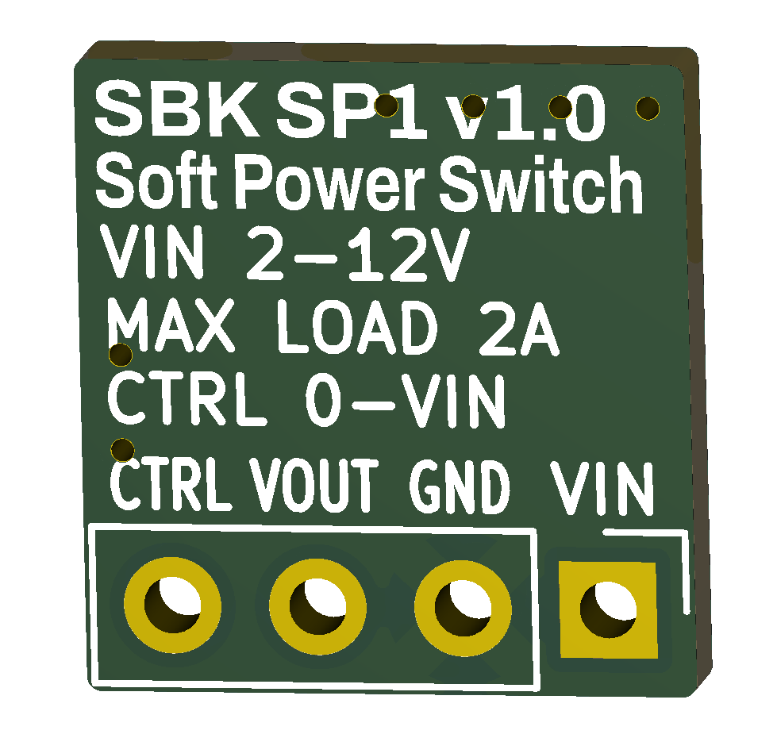

# SBK_SP1

<p align="center">
  
  &nbsp;&nbsp;&nbsp;
  
</p>

<p align="center">
  <b>Front</b> &nbsp;&nbsp;&nbsp;&nbsp;&nbsp;&nbsp;&nbsp;&nbsp;&nbsp;&nbsp;&nbsp;&nbsp;&nbsp;&nbsp;&nbsp;&nbsp;&nbsp;&nbsp;&nbsp;&nbsp;&nbsp;&nbsp;&nbsp;&nbsp;&nbsp;&nbsp;&nbsp;
  <b>Back</b>
</p>

---

## Open-source soft power switch module for learning and embedded electronics projects.

SBK_SP1 is a compact, reusable hardware module for battery-powered embedded systems. It allows a momentary push button and a microcontroller GPIO to control power for low-voltage electronic loads while drawing only a few microamps in the OFF state.

Designed for breadboards, prototypes, and educational projects, SBK_SP1 provides an easy way to add professional soft power management to Arduino, ESP32, RP2040, ATtiny, STM32, and similar microcontroller-based systems.

---

## Features

- Input voltage: **2–12 VDC**
- Load current: **up to 2 A**
- High-side **P-channel MOSFET** switching
- Microcontroller-controlled soft power latching
- Ultra-low off-state current
- Power input and output status LEDs
- Breadboard-friendly 2.54 mm pin header
- Optimized for low-cost assembly using JLCPCB Basic components

---

## Pinout

| Pin | Description |
|------|-------------|
| **VIN** | Power input (2–12 VDC) |
| **GND** | Ground |
| **VOUT** | Switched power output |
| **CTRL** | Control input (0–VIN). Drive HIGH to enable the output. |

---

## Typical Application

```text
Battery
   │
SBK_RP1 (optional)
   │
SBK_SP1
   │
Embedded System
```

A momentary push button is connected to the **CTRL** input to power the system. Once the microcontroller has started, it drives **CTRL** HIGH to keep the module enabled. When the application is ready to shut down, the microcontroller releases the **CTRL** pin, automatically removing power from the system.

---

## Operation

1. The user presses the push button.
2. The **CTRL** input goes HIGH.
3. SBK_SP1 enables the power output (**VOUT**).
4. The microcontroller boots.
5. The microcontroller drives **CTRL** HIGH to maintain power after the button is released.
6. When shutdown is requested, the microcontroller drives **CTRL** LOW (or configures it as a high-impedance input).
7. SBK_SP1 disconnects power from the load.

---

## Applications

### Microcontroller platforms

- Arduino
- ESP32
- RP2040
- ATtiny
- STM32

### Example applications

- Portable instruments
- Battery-powered sensors
- Educational electronics projects
- Custom embedded devices
  
---

## Notes

- Designed for low-voltage embedded electronics.
- Inductive loads require an external flyback diode or equivalent protection.
- High-capacitance loads may require inrush-current limiting.

---

## Getting Started

This project is fully open-source hardware. You can:

- Build your own board using the provided KiCad design files.
- Modify the design to suit your application.
- *(Coming soon)* Purchase a fully assembled board from my Tindie store if you prefer to start experimenting immediately.

👉 [**SBK Tindie Store**](https://www.tindie.com/stores/smartbuildskits/)

---

## Related Projects

- [**SBK_RP1**](https://github.com/sbarabe/SBK_RP1) – Reverse Polarity Protection Module
- [**MémoBot**](https://github.com/sbarabe/MemoBot) – Educational memory game built using SBK_SP1 and SBK_RP1

---

## License

This project is released as open-source hardware under the **CERN Open Hardware Licence Version 2 - Permissive (CERN-OHL-P v2)**.

You are free to study, modify, manufacture, and distribute this design, provided the terms of the license are respected.

See the [LICENSE](LICENSE) file for the full license text.

---

## Design Files

This project was designed using **KiCad 10**.
