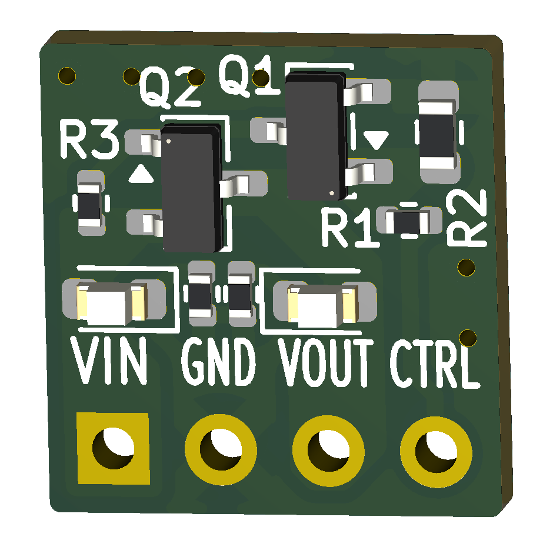
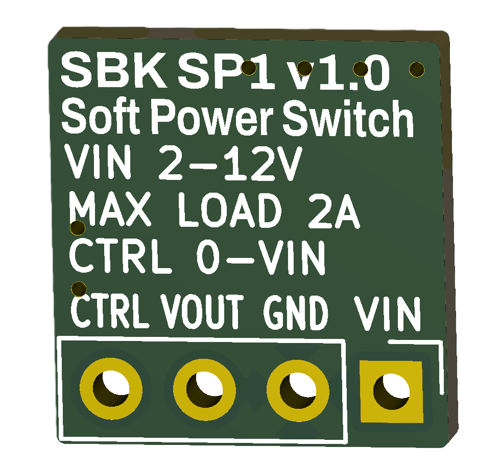

# SBK_SP1

<p align="center">
  
  &nbsp;&nbsp;&nbsp;
  
</p>

<p align="center">
  <b>Front</b> &nbsp;&nbsp;&nbsp;&nbsp;&nbsp;&nbsp;&nbsp;&nbsp;&nbsp;&nbsp;&nbsp;&nbsp;&nbsp;&nbsp;&nbsp;&nbsp;&nbsp;&nbsp;&nbsp;&nbsp;&nbsp;&nbsp;&nbsp;&nbsp;&nbsp;&nbsp;&nbsp;
  <b>Back</b>
</p>

---

## Open-source soft power switch module for learning and embedded electronics projects.

**SBK_SP1** is a compact, reusable soft power switch module for battery-powered and low-voltage embedded systems. 

A momentary push button, maintained switch, or external control can turn the system on. Once powered, a microcontroller can assert the **HOLD** input to keep the system running independently of the switch state. 

**Version 2.0** adds an onboard start button, a dedicated external **SW** input, and an independent **SENS** output. This allows the microcontroller to continue monitoring the external switch while holding its own power on, making graceful software-controlled shutdown possible. 

Designed for breadboards, prototypes, and educational projects, **SBK_SP1** provides an easy way to add soft power management to Arduino, ESP32, RP2040, ATtiny, STM32, and similar microcontroller-based systems.

---

## Features

- Input voltage: **2–12 VDC**
- Load current: **up to 2 A**
- High-side **P-channel MOSFET** switching
- MCU-controlled soft power latch
- Onboard power/start button
- External momentary button or maintained switch input
- Independent switch-state sensing
- Supports graceful MCU-controlled shutdown
- Ultra-low off-state current (< 1 µA typ.)
- Power input and output status LEDs
- Breadboard-friendly 2.54 mm pin header
- Open-source hardware
- Optimized for low-cost assembly using JLCPCB Basic components

---

## Specifications 
| Parameter | Specification | 
|---|---| 
| Input voltage | 2–12 VDC | 
| Maximum load | 2 A | 
| Off-state current | < 1 µA typical | 
| HOLD input | Active HIGH, 2 V–VIN | 
| SW input | Active LOW, connect to GND | 
| SENS output | Active LOW, external/MCU pull-up required | 
| PCB size | 15.8 × 11.2 mm | | Pin pitch | 2.54 mm |

---

## Pinout

| Pin | Description |
|------|-------------|
| **VIN** | Power input (2–12 VDC) |
| **GND** | Ground |
| **VOUT** | Switched power output |
| **HOLD** | Active-HIGH MCU power-hold input. Drive HIGH (2 V–VIN) to keep VOUT enabled. | 
| **SW** | Active-LOW external switch input. Connect to GND to start/activate the module. | 
| **SENS** | Active-LOW switch-sense output. Connect to an MCU input with an internal or external pull-up. | 


The onboard push button is connected to the **SW** function and can be used to start the module without an external switch.

---

## Typical Application

```text
Battery / Power Supply
         │
         │
        VIN
   ┌───────────┐
   │  SBK_SP1  │
   │           │
   │   VOUT    ├──────────> Embedded System Power
   │           │
MCU├─ HOLD <───┤ MCU output
   │           │
MCU├─ SENS ───>│ MCU input with pull-up
   │           │
   │    SW     ├──── Switch / Push Button ──── GND
   └───────────┘
         │
        GND
```

---

## Operation

### Power On
1. The user presses the onboard button or connects **SW** to GND.
2. The hardware immediately enables the high-side power MOSFET.
3. **VOUT** powers the microcontroller and load.
4. **SENS** goes **LOW**, allowing the microcontroller to detect the active switch.
5. The microcontroller boots and drives **HOLD HIGH**.
6. The module remains powered after a momentary button is released.

### Power Hold

While **HOLD** is **HIGH**, the microcontroller keeps **VOUT** enabled independently of the state of **SW**.

Because **SENS** monitors the switch separately from the **HOLD** circuit, the microcontroller can continue detecting button presses, button releases, or changes in a maintained external switch while power remains latched.

### Graceful Shutdown

With a maintained ON/OFF switch, SBK_SP1 can support a software-controlled shutdown sequence:

1. The external switch connects **SW** to **GND** to start the system.
2. The microcontroller boots and drives **HOLD HIGH**.
3. The user opens the external switch.
4. **SENS** returns **HIGH** while **HOLD** keeps the system powered.
5. The microcontroller detects the switch change and performs any required shutdown tasks.
6. When shutdown is complete, the microcontroller drives **HOLD LOW**.
7. **SBK_SP1** disconnects **VOUT** from the load.

This allows firmware to save data, stop peripherals, or perform other cleanup before removing power.

---

## Using a Momentary Push Button

SBK_SP1 can also be used with a conventional momentary push button.

Connect the external button between **SW** and **GND**, or simply use the onboard button.

A button press starts the system and pulls **SENS LOW**. The microcontroller can then assert **HOLD** to keep itself powered after the button is released.

Because **SENS** remains independent of **HOLD**, the same button can continue to be monitored by the firmware while the system is running.

---

## Applications

### Microcontroller platforms

- Arduino
- ESP32
- RP2040
- ATtiny
- STM32

### Example applications

- Portable instruments
- Battery-powered sensors
- Educational electronics projects
- Custom embedded devices
  
---

## Notes

- **HOLD** is an active-HIGH input and should not exceed **VIN**.
- **SW** is an active-LOW input and is activated by connecting it to **GND**.
- **SENS** is an active-LOW sense signal and requires an external or MCU internal pull-up.
- The onboard push button and external **SW** input operate in parallel.
- Do not apply an external positive voltage directly to **SW**.
- Inductive loads require an external flyback diode or equivalent protection.
- High-capacitance loads may require inrush-current limiting.
- The 2 A rating is the maximum recommended module load; consider wiring, connector, thermal, and application conditions when operating near the maximum current.

---

## Getting Started

This project is fully open-source hardware. You can:

- Build your own module using the provided KiCad design files.
- Modify the design to suit your application.
- Manufacture your own boards.

### Assembled Modules

If you prefer a ready-to-use module, fully assembled SBK_SP1 boards may be available in small batches on demand.

For availability, pricing, or quantity inquiries, contact:

📧 **SmartBuildsKits@gmail.com**

These modules are intended for hobbyists, educators, prototypes, and small-scale projects. Availability depends on component stock and production capacity.

---

## Related Projects

- [**SBK_FET1**](https://github.com/sbarabe/SBK_FET1) – N-Channel/P-Channel FET modules
- [**SBK_RP1**](https://github.com/sbarabe/SBK_RP1) – Reverse Polarity Protection Module
- [**MémoBot**](https://github.com/sbarabe/MemoBot) – Educational memory game built using SBK_SP1 and SBK_RP1

---

## Contributing

Suggestions, bug reports, and improvements are welcome.

To report a problem or suggest an improvement, open an Issue. Pull Requests are also welcome for corrections, documentation improvements, and design changes that make the project easier to understand or build.

---

## Support the Project

If this project is useful for learning, teaching, or prototyping, you can support its continued development.

Donations help fund prototype hardware, documentation, educational resources, and future open-source projects.

❤️ [**Support the project through PayPal**](https://paypal.me/sbarab?country.x=CA&locale.x=fr_CA)

Thank you for supporting open-source educational hardware.

---

## License

This project is released as open-source hardware under the **CERN Open Hardware Licence Version 2 - Permissive (CERN-OHL-P v2)**.

You are free to study, modify, manufacture, and distribute this design, provided the terms of the license are respected.

See the [LICENSE](LICENSE) file for the full license text.

---

## Design Files

This project was designed using **KiCad 10**.
